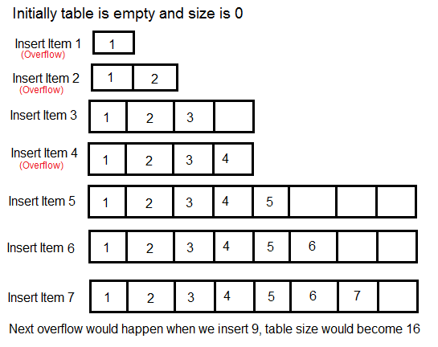

# Lab 03: Dynamic Arrays

1. [Background Info](#background-info)
   1. [Arrays](#arrays)
   2. [Dynamic Arrays (Resizable Arrays)](#dynamic-arrays-resizable-arrays)
   3. [Amortized Analysis](#amortized-analysis)
2. [Tasks](#your-task)
3. [Requirements](#requirements)

----------------------------------------

### Background Info

##### Arrays

Arrays are one of the most common and versatile data structures and are essential to almost any useful C or C++ program. They allow us to store hundreds, or even thousands, of elements inside of memory while providing random access in `O(1)` to all of them. While these helpful structures provide us with near-instant access to our data whenever we need it, they are not without weakness. When using regular C-style arrays, you must declare a fixed size for them at the time of their creation and, once this size is declared, it cannot be changed.

```C++
// this array is limited to a maximum of 100 elements, it CANNOT hold more
int myArray[100];
// this array is dynamically *allocated* but its size is still static
int *myOtherArray = new int[100];
```

This presents an obvious problem: What if you don't know how much space you need in your array at compile time? On one hand, if you declare an array with too little space, you will have nowhere to store additional values. On the other hand, if you always declare an array with maximum capacity (e.g. `ULLONG_MAX` equal to 18446744073709551615) you will almost certainly have enough space, but you will be wasting huge amounts of unused memory in almost any situation.

As it turns out, the solution to the problem of capacity is to use *Dynamic Arrays*.

##### Dynamic Arrays (Resizable Arrays)

Dynamic Arrays are similar to regular C++ arrays in that they still provide random access in constant time to to elements. However, Dynamic Arrays have the advantage of being **dynamically resizable**. This means that they can grow as you add more elements to them and shrink as you no longer need space. Using a Dynamic Array, you don't need to know the size of a list at compile time.

The way a Dynamic Array works is to begin with a starting size (often 0). For every insert, we do one of two things depending on the current state of the array:

```
Array is NOT full:
	insert into our array 
Array IS full:
	allocate memory for new array
	copy data from old array into new array
	delete the old array
```

>If you have programmed previously, chances are you are already familiar with data structures that implement the same idea as dynamic arrays in one language or another. C++ provides an implementation `std::vector<>`. Java's implementation is called an `ArrayList<>`.

The goal of this assignment is to implement your own Dynamic Array Class in C++.

##### Amortized Analysis

For arrays, it is a simple task to see that an **insert** operation runs in O(1) time. We have random memory access, and all of the space we need is already allocated. It does not matter if we are inserting into index 0, or index 10,000; both operations will take the same amount of time. Most functions are also fairly simple to calculate Big-Oh; just count the instructions. 

But what about for a Dynamic Array? Some inserts will take O(1) time, but others will require the above steps to resize of the array (O(n)). Observe the following series of inserts:



Any time there is the (Overflow) label, that is saying the array must be resized. How can we calculate the run time for a function (insert) for a function that is sometimes O(1), and sometimes O(n)? Well, we essentially just take the average:


---

### Your Task

In order to implement your own class, we are providing starter code. You will be given a [*header file*](scaffolding/DynamicArray.h) (`DynamicArray.h`) and a partially-implemented [*source file*](scaffolding/DynamicArray.cpp) (`DynamicArray.cpp`) for a class `DynamicArray`.

```c++
#ifndef DYNAMIC_ARRAY_H
#define DYNAMIC_ARRAY_H

#include <string>

class DynamicArray {
    private:
        // the number of items currently in the array
        unsigned int m_length; 
        // the number of available spaces in the array
        unsigned int m_capacity; 
        // the scaling factor when resizing the array (always > 1)
        double m_scaling_factor; 
        // pointer to the array of integers
        int *m_data;

    public:
        // default constructor, capacity = 0, no need to allocate an internal array yet
        DynamicArray(); 
        // default constructor with a scaling factor, creates an array with capacity = capacity
        DynamicArray(double scaling_factor, unsigned int capacity); 
        // fill constructor, creates an array of capacity = length, and set all values to `default_value`
        DynamicArray(double scaling_factor, unsigned int length, int default_value); 
        // copy constructor
        DynamicArray(const DynamicArray& other); 
        // default destructor, free memory of the array here
        ~DynamicArray(); 

        // get the number of elements in the array
        unsigned int get_length();
        // get the capacity of the array
        unsigned int get_capacity();
        // get scaling factor Needed by GUI 
        double get_scaling_factor();
        // set the scaling factor of the array
        void set_scaling_factor(double value);
        // convert the vector into a printable string 
        std::string to_string();

        // find the first occurrence of "value" in the array. Return false if the value is not found
        bool find_first_of(int value, unsigned int* index);
        // find the last occurrence of "value" in the array. Return false if the value is not found
        bool find_last_of(int value, unsigned int* index);

        // add a value to the end of the array (resize if necessary)
        void append(int value); 
        // add a value to the beginning of the array (resize if necessary)
        void prepend(int value); 
        // remove the last value from the array
        void remove_last();
        // remove the first value from the array 
        void remove_first();
        // remove all elements from the array 
        // allocated memory should be deleted and the array pointer should now point to NULL
        // capacity and length should be reset to zero
        void clear(); 

        // overloading the [] operator for read/write access
        int& operator[](unsigned int index); 
        // assignment operator
        DynamicArray& operator=(const DynamicArray &other); 
};

#endif
```

```c++
#include "DynamicArray.h"
#include <cstring>

// "Fancy" way to write a default constructor.
// Note: The other constructors can *NOT* be written this way!
DynamicArray::DynamicArray()
    : m_length(0), m_capacity(1), m_scaling_factor(2.0), m_data(new int[1]) {
}

DynamicArray::DynamicArray(double scaling_factor, unsigned int capacity) {
    //..............
    // TODO
    //..............
}


DynamicArray::DynamicArray(double scaling_factor, unsigned int length, int default_value) {
    //..............
    // TODO
    //..............
}

DynamicArray::DynamicArray(const DynamicArray& other) {
    // use the assignment operator
    (*this) = other; 
}

// Destructor: destroys the dynamically allocated array on the heap
DynamicArray::~DynamicArray() {
    delete[] m_data;
}

unsigned int DynamicArray::get_length() {
    return m_length;
}

unsigned int DynamicArray::get_capacity() {
    return m_capacity;
}

double DynamicArray::get_scaling_factor() {
    return m_scaling_factor;
}

void DynamicArray::set_scaling_factor(double value) {
    m_scaling_factor = value;
}

std::string DynamicArray::to_string() {
	// Initialize an empty string
    std::string str("");
	
	//..............
    // TODO
    //..............

    return str;
}

bool DynamicArray::find_first_of(int value, unsigned int *index) {
    bool found = false;
    //..............
    // TODO
    //..............
    return found;
}

bool DynamicArray::find_last_of(int value, unsigned int *index) {
    bool found = false;
    //..............
    // TODO
    //..............
    return found;
}

void DynamicArray::append(int value) {
    //..............
    // TODO
    //..............
}

void DynamicArray::prepend(int value) {
    //..............
    // TODO
    //..............
}

void DynamicArray::remove_last() {
    //..............
    // TODO
    //..............
}

void DynamicArray::remove_first() {
    //..............
    // TODO
    //..............
}

void DynamicArray::clear() {
    //..............
    // TODO
    //..............
}

// Examples of "operator overloading"
int& DynamicArray::operator[](unsigned int index) {
    return m_data[index];
}

DynamicArray& DynamicArray::operator=(const DynamicArray &other) {
    m_length = other.m_length;
    m_capacity = other.m_capacity;
    m_scaling_factor = other.m_scaling_factor;
    m_data = new int[m_capacity];
    std::memcpy(m_data, other.m_data, sizeof(int) * m_length);
    // this allows statements such as (a = b = c) assuming a, b, and c are all the DynamicArray type
    return (*this); 
}
```

Some functions have already been implemented for you inside of the `DynamicArray.cpp` file. The rest of the functions are up to you to implement, specifically where you see `// TODO` comments. You may add your own **private helper functions** should you wish.

> Note: You must modify any of the given private variables, public function signatures and / or implementations into your gen-AI structure acquired.

---

### Requirements

In/at your lab group/table, prompt ChatGPT-3.5 for a dynamic array (based on standard array or vector structure) to satisfy the following class functions:

1. Complete `to_string()`, `append()`, and `prepend()`
2. Complete `find_first_of()` and `find_last_of()`
3. Complete `remove_last()`, `remove_first()`, and `clear()`

[_Note: You will use this to modify the scaffolding to work within the parameters of the lab. Any manipulation of the ChatGPT/scaffolding code must be explicitly commented as to what and why you are making the alteration. Alterations not commented may be considered an act of cheating and addressed accordingly._]

Next, you will create your own `main.cpp` file to test your implemented functions. You must include the link to the prompt you used to retrieve your dynamic array structure as a comment at the top of your `main.cpp`. You must use CLAs to control how your program runs. The CLAs given to your program will determine which constructor will be used. e.g. if I run `./prog input.txt 2.5 10` then I will create a DynamicArray with `scaling_factor` of 2.5 and an initial `capacity` of 10. However, if I run it with no additional CLAs other than the input file then it will use the default constructor.

  The first test case will use the following input file located in the `data` folder, the other two test cases are hidden from you:

``` 1 2 3 4 5 6 7 8 ```

Your program should perform the following tasks once the `DynamicArray` object is created:

- Read an unknown number of integers from a file (it is fine to use the `vector` class to hold these temporarily)
  - You'll need to use the `fstream`, `sstream`, and `string` libraries to parse this file
- Instantiate an instance of DynamicArray
- Perform the following actions, displaying the results of `to_string` after each:
  - `append` the first 1/2 of the integers to your DynamicArray (integer division for odd length collections)
  - `prepend` the second 1/2 of the integers to your DynamicArray
  - `find_first_of` the value 1/3 of the way through the original list (use a tab to seperate the true/false and the index)
  - `find_last_of` the value 1/3 of the way through the original list (use a tab to seperate the true/false and the index)
  - `remove_last`
  - `remove_first`
  - `clear`

