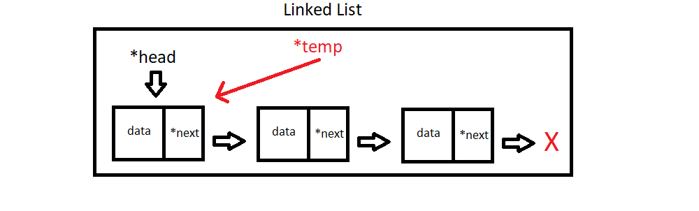
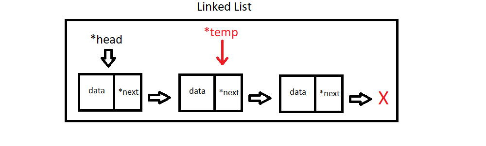
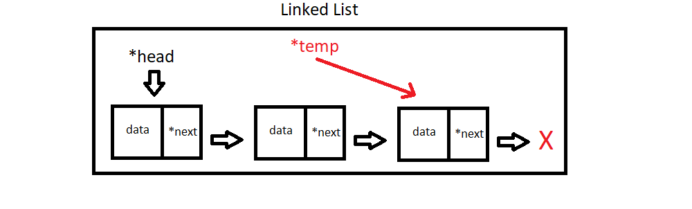
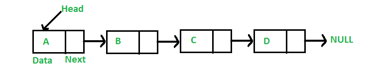
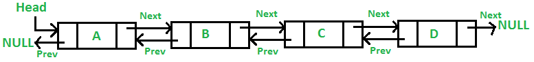
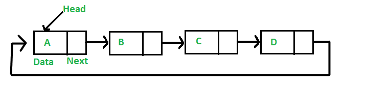
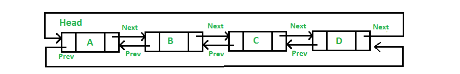

On this page:  
✔️ [Motivation](#motivation)  
✔️ [Background Info](#bgi)  
✔️ [Your Task](#task)  
✔️ [Requirements](#reqs)  
✔️ [Handing in](#submit)  
✔️ [Grade Breakdown](#grading)

#### Motivation (Why are we doing this?) {#motivation}
The goal of this lab is to provide a **review of pointers** while giving you an under-the-hood introduction to the `Linked List` data structure.

---

#### Background Info {#bgi}

##### Pointers & References

Pointers & references can be a bit confusing at first in C++ as the language uses the same symbols for multiple operations. For example, the ```*``` symbol can be used to create a pointer, or to de-reference a pointer. Similarly, the ```&``` symbol can be used to create a reference or to obtain the memory address of an existing variable. Hopefully by the end of this lab we will de-mystify this concept and will all be comfortable with using them.

To be more efficient, the code we'll be writing passes the vector of elements to be sorted by **reference**. This makes it so we do not need to make multiple copies of the vector (a mistake some of you made on assignment one), as copying a vector is an expensive operation. There are three ways in C++ to pass by reference:

* A pointer ``` int *my_ptr; ```
  * This will create a pointer (memory address) to "point" to the memory address given to it. This pointer can be re-assigned, and pointer arithmetic can be performed on it. To access the data stored in a pointer (de-reference), use the \* operator again.
* A constant pointer ```int * const my_const_ptr;```
* This will create a constant pointer (memory address) to "point" to the memory address given to it. This pointer can NOT be re-assigned & pointer arithmetic can be performed on it. To access the data stored in a pointer (de-reference), use the \* operator again.
* A reference ```int &my_reference```. This creates a "constant pointer" as above, but with automatic indirection. In other words, it automatically de-references for you when needed which means when accessing the value inside of the memory address you do not need to explicitly dereference.

When you pass a variable by reference, you pass the memory address that this variable is located. This makes it so any change made in the function affects the data directly, instead of affecting a copy. In this way no return is necessary to operate on information sent from the main. No copy is needed so both memory and time creating the copy is saved.

Below is a brief piece of code that showcases a simple usage of a pointer to modify a variable. Feel free to put this into [PythonTutor](http://www.pythontutor.com/cpp.html#mode=edit) to view a visualization.

```c++
#include <iostream>

int main(){
    int my_var = 5;

    // Prints 5
    std::cout << my_var << std::endl;

    // Create a "pointer to an integer" called 'ptr'
    int * ptr;

    // Obtain the memory address of 'my_var' and store it into 'ptr'
    ptr = &my_var;

    // De-reference 'ptr' and change the value stored in that memory address (5) to 10
    *ptr = 10;

    // Prints 10
    std::cout << my_var << std::endl;
}

```

Taking that same concept, we can use a pointer to modify a variable even if we are out of scope.

```c++
#include <iostream>

void AddFive(int * ptr);

int main(){
    int my_var = 5;

    // Prints '5'
    std::cout << my_var << std::endl;

    AddFive(&my_var);

    // Prints '10'
    std::cout << my_var << std::endl;
}

void AddFive(int * ptr){
    *ptr += 5;
}
```

Here is this same code with a "constant pointer".

```c++
#include <iostream>

void AddFive(int * const ptr);

int main(){
    int my_var = 5;

    // Prints '5'
    std::cout << my_var << std::endl;

    AddFive(&my_var);

    // Prints '10'
    std::cout << my_var << std::endl;
}

void AddFive(int * const ptr){
    *ptr += 5;
}
```

And once more with a "reference". Note here because my_var was passed by reference, no explicit dereferencing using the * symbol was needed to operate on it in the AddFive function.

```c++
#include <iostream>

void AddFive(int & ptr);

int main(){
    int my_var = 5;

    // Prints '5'
    std::cout << my_var << std::endl;

    AddFive(my_var);

    // Prints '10'
    std::cout << my_var << std::endl;
}

void AddFive(int & ptr){
    ptr += 5;
}
```

Take a look at [this article](https://www.geeksforgeeks.org/pointers-vs-references-cpp/) for a little more reading on pointers and references, then answer these questions.

##### Linked Lists

We'll start with a brief introduction to Linked Lists & a brief description of the types of Linked Lists.

###### The Node Class

Linked Lists are your first introduction to a dynamically resizing data structure that does **not** involve a copy operation. A Linked List is only ever as large as it needs to be. Unlike an array, data does not get stored directly into any primitive storage container. Instead, we utilize a second concept called the `Node`. Each `Node` contains the data it is storing, as well as a pointer(s) to neighboring nodes, with the amount of pointers depending on the type of Linked List being implemented. This class is meant to be very simple: each `Node` object holds: the datum and pointer(s) to other `Node` objects. Aside from constructors, getters, and setters are all you need to add to the `Node` class.


###### The Linked List Class

In a Linked List,`Nodes` are *linked* together to form a data structure, hence the name. The primary goals of the LinkedList class are to provide an entry point into the data structure (the `head pointer`) and facilitate traversal, insertion, deletion, etc. The Linked List class contains a `head pointer`, as well as any utility functions that should operate on the structure (some are listed below.)


###### Linked List Traversal

For many operations, we will be required to traverse the Linked List in order to get to the location we plan to perform an operation on. A quick reminder on going about this task; **you cannot move the head pointer!** If you do, you will lose access to all of the data in your list. Instead, we make use of a temporary pointer.



We start by creating a temporary pointer and making the assignment `temp = head`, so both `head` and `temp` point to the same location in memory (the first `Node`.)



To advance our temporary pointer, we use `temp = temp.next`. `temp.next` obtains the memory address of the `Node` pointed to by `temp`, and the assignment operator makes `temp` point to it.



This process repeats until some terminating condition is met. This condition will depend on the operation you are performing.

###### Singly Linked List



- Each node (pair of boxes) contains data (in this case integers), and a pointer to the next node.
- There is also a `head` pointer, which should always point to the first node in the linked list as long as operations are not currently being performed on it (i.e, "the `head` pointer points to the first node" is an *invariant* of a singly linked list).

###### Doubly Linked List



- Each node (triad of boxes) contains data (in this case integers), a pointer to the next node, *and* a pointer to the previous node.

- There is also a `head` pointer, which should always point to the first node in the linked list as long as operations are not currently being performed on it (i.e, "the `head` pointer points to the first node" is an *invariant* of a doubly linked list).

> **Note:** The `head` node's `prev` points to `nullptr`.

###### Circularly Singly Linked List



- Each node (pair of boxes) contains data (in this case integers), and a pointer to the next node. This time, the final node points back to the head node.
- There is also a `head` pointer, which should always point to the first node in the linked list as long as operations are not currently being performed on it (i.e, "the `head` pointer points to the first node" is an *invariant* of a circularly singly linked list).

###### Circularly Doubly Linked List



- Each node (triad of boxes) contains data (in this case integers), a pointer to the next node, *and* a pointer to the previous node.  
- The `head` node's `prev` points to the last element, and the last element's `next` points to `head`.  
- There is also a `head` pointer, which should always point to the first node in the linked list as long as operations are not currently being performed on it (i.e, "the `head` pointer points to the first node" is an *invariant* of a circularly doubly linked list).

##### Visualizing Singly-Linked List Operations

To begin our journey of fully understanding the inner-workings of linked lists, we will start by coding the simplest of the bunch: the singly linked list. Below are some visual representations for basic operations.

###### push_front


As we already have access to the head of the list, push_front is rather easy to implement. Simply create a new node, assign its 'next' to head, and assign head to the new node!

###### push_back


We'll need to do a bit more work to insert at the end of the list. Seeing as we only have access to 'head', we'll need to create a temp pointer that points to 'head', then traverse until we reach the end of the list.

###### insert


Similar to push_back, we need to traverse the list until we arrive at a particular location. Except this time, we don't just traverse until the end; we need to keep count of what "index" we are at in order for the function to work as intended.

###### delete


Deletion is a trickier operation than any of the inserts, as you'll need to use *two temp pointers* to complete this operation. Their final state is given above if 'C' were being deleted. You'll need to move the pointers together, and `prev` should trail `tmp`

---

#### Your Task {#task}

Your task is to create both a ```LinkedList``` class that utilizes a ```Node``` class that stores integers, and performs the following tasks:

- `push_front`
  - Adds an integer to the front of the list.
- `push_back`
  - Adds an integer to the end of the list.
- `insert`
  - Adds an integer to the list at a specific index.
- `delete`
  - Searches for & removes a specific element in the list.
- `contains`
  - Returns true if the given value exists in the list, false otherwise.
- `size`
  - Returns the # of elements in the list.
- `to_string`
  - Returns all elements in the list concatenated into a single string.
    The list 5 -> 3 -> 4 -> 2 would return "5 3 4 2"

---

#### Requirements {#reqs}
Your program will read in the name of a file via CLA.

The first line in the file will control which constructor will be used (similar to Lab 3). Examine the constructor declarations to determine the possible cases you will need to check for.

After the first line is read, the rest of the file will contain a series of commands, 1 per line, that must be followed:

- An integer
  - odd integers get prepending to the list
  - even integers get appended to the list
- A pair of integers
  - val, idx to be inserted
- A negative integer
  - the integer to be deleted from the list
  - Note: You'll need to remove the '-' before passing the value to the function!
- An integer with a question mark
  - the integer to search for in the list
  - Note: Again, you'll need to remove the '?' before passing the value to your function!

After each command is read and executed, print out the list **if there have been any changes**.

This is the output for **test1.txt** that you have been given:

```
45 3 37 79 97 25 22 7 19 83
45 3 37 79 97 25 22 7 19 83 70
45 3 37 79 97 25 22 7 19 83 10 70
21 45 3 37 79 97 25 22 7 19 83 10 70
21 45 37 79 97 25 22 7 19 83 10 70
21 45 37 79 97 25 7 19 83 10 70
0
0
21 45 37 79 97 25 19 83 10 70
21 45 37 79 97 25 19 83 10 70 1
1
```

---

## [Submission](#1-introduction)

You should submit the following files:

- linked_list.h
- linked_list.cpp
- node.h
- node.cpp
- main.cpp
---

Original assignment by [Dr. Marco Alvarez](https://homepage.cs.uri.edu/~malvarez/), used and modified with permission.
