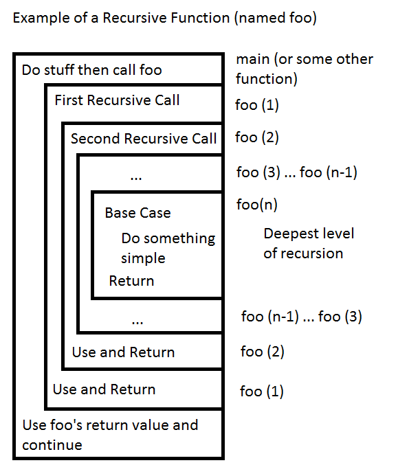
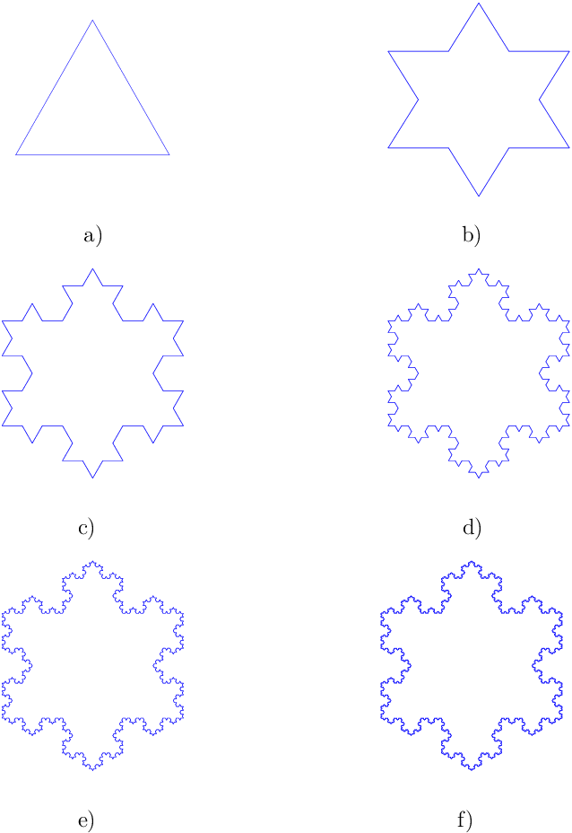
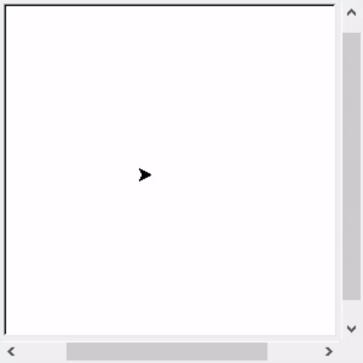
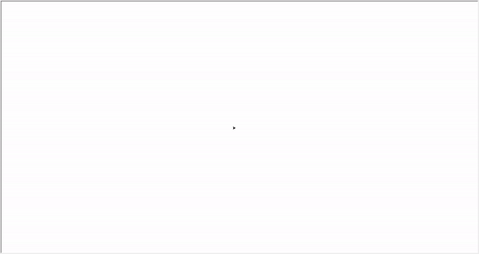

# Lab 06: Recursion

## Introduction

Recursion is the practice of breaking a complicated problem down into small, trivially solvable pieces, and then merging those pieces together to solve the full problem completely. Today you will be implementing a few recursive algorithms. The neat thing about recursion is that you can solve problems with a relatively small amount of well thought out code.

## A Quick Review of Recursion

In its simplest form, recursion is simply when a function calls itself within its own body. When a recursive function calls itself, a new stack frame is pushed onto the call stack with a slightly different set of parameters (if the parameters do not change it may recurse forever!). Calling itself allows the function to start again from the first line using the new parameters. The function call associated with this new stack frame will likely reach a point where it calls itself again, creating yet another stack frame with, again, with slightly different parameters. This process repeats until the base case is reached.

At first, this may seem like an infinite loop of sorts, but if the function is implemented correctly, the input should be modified at each call such that the parameters get closer to triggering the base case. In the base case, some non-recursive code is executed, and the function is able to return to whichever stack frame came before it, picking up where it left off. One by one, each call to the recursive function will complete, having done some processing on the input, and return its own result. If the function is implemented without a base case, or continually recurses without reaching one, the program will instead crash with a stack overflow error.

### How to think about recursive function calls



In the above diagram, each box is a call to the recursive function `foo`. In the base case, simple, often times even trivial, steps are taken for some special case of the input. After returning from the base case, each call to `foo` may *use* the result returned to it and return to its caller.

**Note:** Each deeper level of recursion is solving a smaller problem, so when you think of a recursive algorithm, you will often ask yourself three questions: "How can I make this input smaller?", "What is the base case I am working towards?" and "How do I use solutions to the smaller problem to solve the bigger problem?"

## 0. Sum of Numbers

Before you begin implementing recursive algorithms for yourself, you'll be guided through each step of a recursive implementation of the sum from 1 to n. Along the way, you will see which part of the algorithm corresponds to which concept, and hopefully you will get a better understanding of how to think about a recursive algorithm.

First, open the file `sum.cpp` that came with this lab (or copy it in if you're not using git). All you have is a small `main` and an empty function `sum` which presently returns 0. Enter each of the following lines after reading the description for each, starting at line `4`.

``` cpp
if (n == 0) {
    return 0;
}
```

For most recursive algorithms, the best place to start is the base case, and since it's so important (and allows you to end your function early with a `return`) it will often be at the top. The base case should be a small sub-problem which can be solved easily. In this case, `sum(0)` should sum no numbers from 1 to n, so it is defined to be 0, which will be a useful value when we consider the recursive step. Thus, you should note there are two important things going on here: we are *checking for the base case* with `n == 0`, and we are *solving the base case* by returning 0.

``` cpp
unsigned long sub_sum = sum(n - 1);
```

To reach this line, the base case must be false `(n != 0)`, and so we must now recurse. We have already solved the question asking "what is the base case?" so now we address "how can the input size be reduced?". Observe that the sum of all numbers from 1 to n uses the sum of all numbers from 1 to n-1 in the result, so we can get that sum by calling `sum(n - 1)` and storing it in a variable. Now we should have the solution to a smaller problem, which we can use in the solution to the whole problem.

> Note: Often times instead of storing the value of the recursive call in a variable we will use it directly, either in some other computation to be stored in a variable or right in the return statement itself.

``` cpp
unsigned long total = n + sub_sum;
```

Finally, we address the third question: "how can the solution to the smaller problem be used to solve the whole problem?". In this case it is fairly trivial, in that since we're summing the numbers from 1 to n, and we have the sum from 1 to n-1, we can just add n to the sum from 1 to n-1 to obtain our solution. However, in many algorithms this question is not so trivially answered, and sometimes this part, which is sometimes called the *combination step*, requires a whole separate algorithm to solve. This what is meant by the "use" part of "use and return" in the diagram at the beginning of the lab.

> Note: In some recursive problems, such as fibonacci, there will be more than one sub-problem needing to be solved, requiring multiple recursive calls, typically with different inputs. In such cases, the combination step requires combining the solutions to *all* the sub-problems to solve the whole problem. On the other hand, sometimes there is no combination step required, despite there being recursive calls. This is often the case with recursive functions with side-effects.

``` cpp
return total;
```

The final problem to address is that `sum` is still returning 0, so we will now have it return `total`. Keep in mind that if some function other than `sum` is being returned to, then `total` represents the final solution: the sum from 1 to the original input n. However, if it is returning to another call to `sum`, then `total` represents the sum from 1 to n-1 from the perspective of the call it is returning to.

At this point you can compile and run `sum.cpp`. Since `sum` is called on 10 and on 100, you should get 55 and 5050 respectively. For the case of 10, you can see that the algorithm will give you the following

sum(10) = 10 + sum(9) = 10 + 9 + sum(8) = ... = 10 + 9 + ... + 2 + 1 + sum(0) = 55.

You should now take a moment to consider what the time complexity (big O) of this function is. Despite not having analyzed recursive functions before, you should still be able to come up with an answer and a good reason for it based on what you have seen in this section. Write your answer as a comment above the declaration of `sum()`.

# Exercises

For all exercises, data should be read from a file given via CLA.

## 1. Sum of Digits

Write a recursive function that finds the sum of all digits in a multidigit number stored as an int.

Note: You **cannot** convert the data to a string!

```c++
Input : 12345
Output: 15
```

## 2. Prime Number Checking

Write a recursive function that checks to see if a given integer is prime.

```c++
Input : 6
Output: 0
    
Input : 23
Output: 1
```

## 3. GCD Finding

Write a recursive function that accepts two integers and returns their Greatest Common Denominator (GCD).

```c++
Input : 10 45
Output: 5
    
Input : 121 482731
Output: 1
```

## 4. Un-ordered Permutations

You are tasked with implementing a recursive Un-ordered Permutation Algorithm.

Given the value of N, output all permutations of numbers from 1 to N.

```c++
Input : 2
Output : 1 2
         2 1

Input : 3
Output : 1 2 3
         1 3 2
         2 1 3
         2 3 1
         3 1 2
         3 2 1
```

## 5. Towers of Hanoi

The Towers of Hanoi is a mathematical puzzle consisting of 3 rods and ***n*** disks that begins with all disks stacked on one rod in decreasing size to form a cone.

The objective of the puzzle is to move the entire stack from the starting rod (source) to a target rod (destination) while obeying the following rules:

1. Only one disk may be moved at a time.
2. Each move consists of taking the upper disk from one of the stacks and placing it on top of another stack or on an empty rod.
3. No disk may be placed on top of a disk that is smaller than it.

Here is an illustration of a solution:


Write a recursive function that accepts 3 parameters (*num_disks*, *source_rod*, *destination_rod*) and outputs the moves needed to solve the puzzle.

```c++
Input : 3 1 3
Output: Move disk 1 from tower 1 to tower 3
        Move disk 2 from tower 1 to tower 2
        Move disk 1 from tower 3 to tower 2
        Move disk 3 from tower 1 to tower 3
        Move disk 1 from tower 2 to tower 1
        Move disk 2 from tower 2 to tower 3
        Move disk 1 from tower 1 to tower 3
```

## 6. Challenge (ungraded)

Fractals are geometric figures in which each part has the same statistical character as the entire figure. In other words, the same patterns repeated at varying scales. Here are a few! **Can you find the repeating patterns in each of these fractals?**


> Sierpinski Triangle


##### Sierpinski Triangle

<video width="960" height="540" controls>
  <source src="./images/sierpinski-triangle-3.mp4" type="video/mp4">
</video>

> Koch Snowflake



##### Koch Snowflake

<video width="960" height="540" controls>
  <source src=".images/koch-snowflake-3.mp4" type="video/mp4">
</video>


We can quickly see the repeating patterns in both of these fractals. Your job is to implement them! To this effect, we will be utilizing 'L-systems'.

### L-systems

An 'L-system' is an alphabet of symbols that form strings, which represent a collection of production rules. In this case, we will be the following 'L-system':

F : Move forward

\- : Turn left by some degree

\+: Turn right by some degree

So, a valid string for this system could be "F + F + F + F". If this is run with a turn degree of 90, what shape would we have generated?

Similarly, what shape does the following string with a turn degree of 60 generate? "F - F - F"?

### Task

You will implement both of the fractal shapes above by utilizing an 'L-system'. Your task is to create recursive functions to solve each that generate the string necessary to draw the shape. You have been supplied with some skeleton code to get you started, as well as a python script to convert a generated string into a .png image representation.

Here are some animations to help you in determining the rules for your strings:





### Notes

- Get a feeling for the string you should be generating BEFORE you start coding.
- You may code your solutions on [this repl.it page](https://repl.it/@ChristianEsteve/CSC212-Lab-6).
	- When you run your code, the python script will be run automatically on your outputted string!
- Utilize [this website](https://trinket.io/python/ac4e46dc05) to see your L-System drawn slowly.
- To use the python file locally: `python3 l-system-plotter.py l-system.txt <output file name> <degree for turns>  `
	- If you're not using the repl.it, you can download and use the python script locally.
	- The degree argument should be 60 for both of these problems!


## 7. Submission

Submit all of your source code created to solve all problems.
