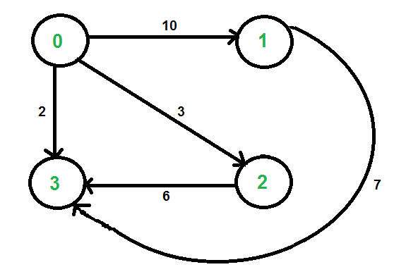
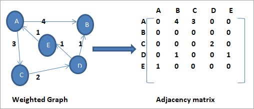
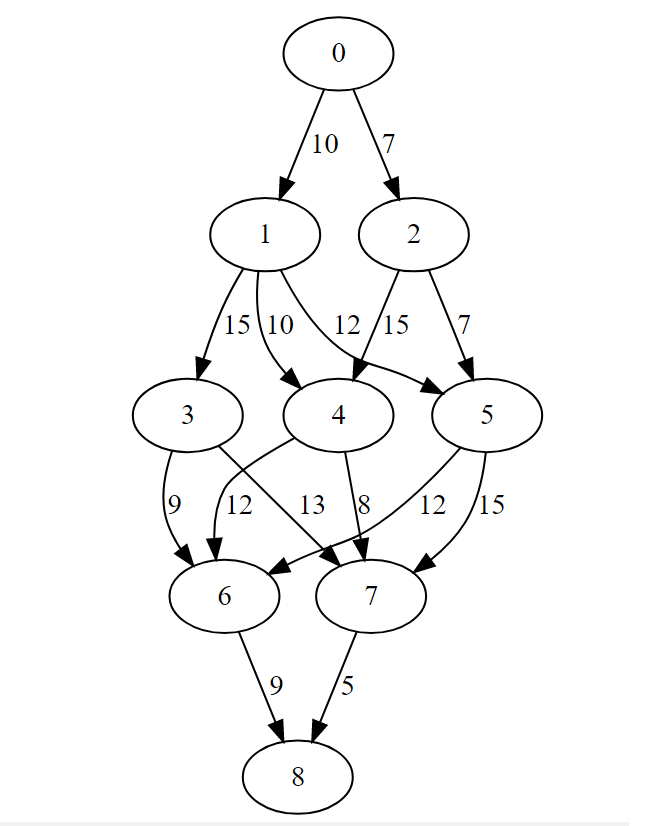
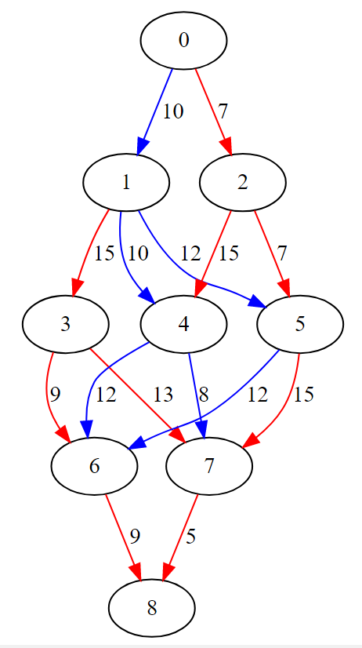
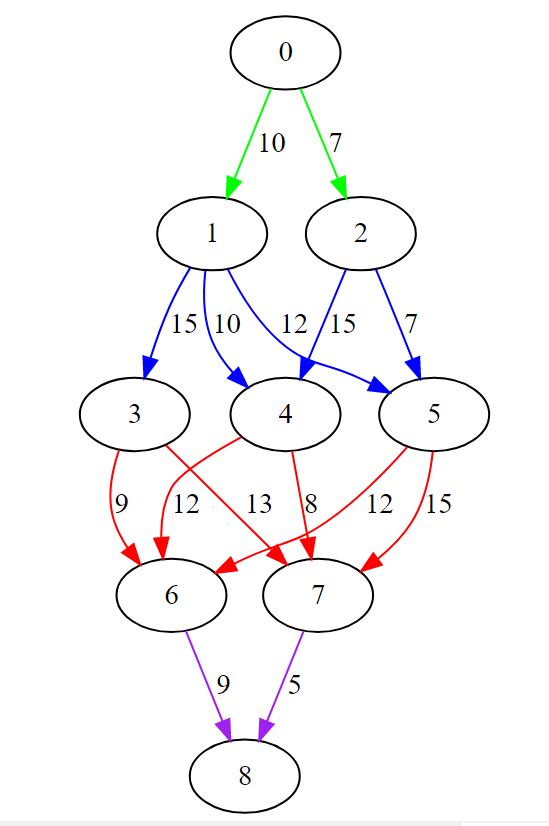

# Lab 12: Graphs

## 1. Introduction

Today you will be writing code for a fully functioning graph. Your task will be to write the functions required to traverse said graph & create several visualizations.

## 2.0 Brief Graph Review

As we know, Graphs come in many forms. Today we will be dealing with a Directed Weighted graph. This type of Graph represents connections between Vertices that are unidirectional & have a weight. Here is an example:



We have 4 Vertices (labeled 0 - 3) with each containing an outgoing Edge that points to another Vertex and has a weight attached to it. Notice the arrows on the outgoing edges. They represent the direction we can travel along this edge. We can go from 0 -> 1, but not from 1 -> 0. This graph also tells us that it costs us less to go from 0 -> 3 than it does to go from 0 -> 1.

## 3.0 Representing Graphs in code

"This is great and all, but how do we code this?" you may be asking at this point. Well, there are a few ways to represent the above graph in code. In an Adjacency Matrix, and in an Adjacency List.

### Adjacency Matrix

Let's start with the easier of the two. An Adjacency Matrix represents a graph by storing weights in a VxV matrix. The first dimension represents the Source, while the second dimension resents the Destination.



Looking at this image, we see a weighted directed graph as well as its Adjacency Matrix representation. From Vertex A, we can get to B at a cost of 4, and to C at a cost of 3. Under the matrix's 'A' row, we see the 4 in the 'B' column and the 3 in the 'C' column. All the relationships given to us in the image is correctly portrayed in the Adjacency Matrix representation. Since these relationships are stored as an array, we can very quickly test for adjacency (a *very* common task.) However, a glaring problem is the amount of wasted space. Look at all of those 0's! While Adjacency Matrices are excellent for storing dense graphs, they unfortunately are not as good at storing sparse graphs (most real-world graphs.)

### Adjacency List

Moving onto the Adjacency List, we now have a structure that stores each Vertex in a vector, and the edges are stored as a list inside of that vector. This saves space, as we do not have to waste memory storing an unknown number of 0s; making them superior in storing sparse graphs.


## 4.0 Visualization

In order to visualize the graphs we are coding, we will be using [the following website](https://dreampuf.github.io/GraphvizOnline/#digraph%20G%20%7B%0A%0A%20%20l1%20-%3E%20l2%3B%0A%20%20l2%20-%3E%20l3%3B%0A%0A%7D).

The .dot format in use is just a text file with specific formatting. Here are the commands you'll need to know:

#### Main code block

```
digraph G {

}
```

#### Display an edge between two nodes

```
<source> -> <destination>
```

#### Give an edge a label

```
[label="<text>"]
```

#### Color an edge

```
[color="<color>"]
```

Here is an example you can copy/paste into Graphviz:
Note: Your solutions **must** follow the *exact* format given below

```
digraph G {

	0 -> 1 [label="5"][color="red"];
	1 -> 2 [label="7"][color="blue"];
    
}
```

## 5.0 Task

Your job will be to implement both an Adjacency Matrix and an Adjacency List, writing functions to visualize 

You are given the `main.cpp` to implement this program. It takes two arguments in the order <input data file name> <mode>

- input date file name: the name of the file containing the source, destination, and cost for all edges in the graph.
- mode: which mode to run in (0-4)
  - 0: print graph of the Adjacency Matrix
  - 1: print default graph of the Adjacency List
  - 2: print even/odd weights graph of the Adjacency List
  - 3: print edge position graph of the Adjacency List
  - 4: print distance from source graph of the Adjacency List

### Adjacency Matrix Tasks

- Create a program that reads a file of *source*, *destination*, and *weight*s and generates an Adjacency Matrix 
- Output the .dot file needed to visualize the graph

### Adjacency List Tasks

- Create a program that reads a file of *source*, *destination*, and *weight*s and generates an Adjacency List
- Output the .dot file needed to visualize the graph



- Color all edges with even weights blue and odd weights red and output the .dot file needed to visualize the graph



- Color all edges based on their position in a vertex's list and output the .dot file needed to visualize the graph


- Color all edges based on their distance from the start and output the .dot file needed to visualize the graph (Hint: Use depth-first search!)



## 6.0 Submission

You will submit the following files:
- adjacency_list.h
- adjacency_matrix.h
- main.cpp
